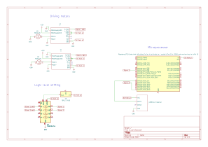

# LunaRoverM25-V2
LunaRoverA25 had some issues with a. torque, b. steering. LunaRoverM25-V2 aims to overcome these problems

## Introduction
I have a dog named Luna. I sometimes feel bad when I leave Luna to entertain herself. I wanted a cool new project to work on. Considering all that, I present to you.... the LunaRover.

## What already exists?
If I wanted to leave my dog in the garden to entertain herself, what products could I procure to achieve that? And how do those products compare to the real deal of me being with Luna? For example, I can give her a stick - which she will play with, but its nothing like the fun she has when I chase her around my garden. To get an understanding of that I thought it'd be useful to present a venn diagram with buckets for: how I currently entertain my dog, what autonomous systems exist, and what powered vehicles exist. The listed items within each bucket are by no means exhaustive, but inspire idea generation nonetheless.


It surprises me that I couldn't find evidence of someone having created an autonomous vehicle to play with their dog... that's something that I've sought to resolve. Note that, this version is manual but by implementing logic from the LunaRoverA25-V1 it can be converted to be automatic (I just haven't got around to that yet as the grass is to wet to test it on in the winter)

## Proposed solution
Create a radio controlled (rc) car which can drive autonomously at the flick of toggle. (this is just for the manual part though).

## Method
### Design new RC car, with a customisable drivetrain
#### Step 1 - Design the RC car
The premise for designing my own RC car from scratch was to address the two failure points alluded to above:
a. Not enough torque
b. Steering mechanism getting caught in long grass

Point "a" can be addressed by having a drivetrain where gear ratio can easily be adjusted, therefore enabling for RPM to be compensated for torque, or vice versa. Point "b" can be addressed by having a dual wheel drive (one motor attached to a wheel on each side), therefore cicumventing the need for a steering system.


#### Step 2 - Design the electronics

The circuit design allows for PWM signals to be sent from the raspberry pi to the brushed dc motors, via the motor drivers. To do that it is necessary that 3.3V logic signals from the raspberry pi are converted to 5V logic signals which can be interpreted by the BTS7960 motor driver. Different PWM signals are sent depending on the Radio Frequency (RF) data received.



#### Step 3 - Design the firmware

Written in Python, this code runs the RF sniffer executable - which listens for rf signals at 433MHz. Data received by the RF sniffer is then translated into a set of actions, and subsequewntly to pulse width modulated (PWM) signals - which are sent to each of the two motors drivers. RF sniffer code (uncompiled c++) is shared beneath the main program code below.

```
from gpiozero import PWMLED
import threading
import time
import subprocess
import os

# Initialise motors
motor1 = PWMLED(17)
motor2 = PWMLED(27)
motor1.on()
motor1.value = 1
motor2.on()
motor2.value = 0
motor1.frequency = 1000
motor2.frequency = 1000

def shifty_motor1(speed):
	motor1.value = 1 - (int(speed)/100)
def shifty_motor2(speed):
	motor2.value = int(speed)/100

# UPDATE THIS to the full path of your RFSniffer executable
rf_sniffer_path = '/home/[pi_username]/433Utils/RPi_utils/RFSniffer'  # Change if your username/folder differs

#print("Listening for RF codes... (Press Ctrl+C to exit)")

# Run RFSniffer directly (no 'sudo' inside) – we'll run the whole script with sudo
process = subprocess.Popen(
    [rf_sniffer_path],
    stdout=subprocess.PIPE,
    stderr=subprocess.STDOUT,  # Merge any errors into stdout
    text=True,
    bufsize=1,                 # Line-buffered
    universal_newlines=True
)

os.environ['PYTHONUNBUFFERED'] = '1'  # Helps in some cases

try:
      for line in process.stdout:
            line = line.strip()
            line = int(line.split("Received ")[1])
            #print(line)  # Optional: raw output for debugging
            if line < 15728640 or line > 16777215:
                continue
            if (line >> 20) & 0xF == 0b1111:
                x = (line >> 10) & 0x3FF
                y = line & 0x3FF

                #print(f"Valid packet x: {x:4d} y: {y:4d}")
                status = "NO MOVEMENT"

                if x < 200 and y < 700:
                    status = "RIGHT"
                    shifty_motor1(100)
                    shifty_motor2(0)
                elif x > 700 and y < 700:
                    status = "LEFT"
                    shifty_motor1(0)
                    shifty_motor2(100)
                elif x < 700 and y > 700:
                    status = "FORWARD"
                    shifty_motor1(50)
                    shifty_motor2(50)
                else:
                    shifty_motor1(0)
                    shifty_motor2(0)               
           
                #print(f">>> Received code: {line} → Classified as: {status}")

except KeyboardInterrupt:
    print("\nExiting gracefully...")
finally:
    process.terminate()
    process.wait()  # Clean shutdown


```

With the RF sniffer code pin 3 refers to the wiring pi pin (as explained [here](https://projects.drogon.net/raspberry-pi/wiringpi/pins/) that corresponds to GPIO22 on the RPi 5 ):
```
/*
  RFSniffer

  Usage: ./RFSniffer [<pulseLength>]
  [] = optional

  Hacked from http://code.google.com/p/rc-switch/
  by @justy to provide a handy RF code sniffer
*/

#include "../rc-switch/RCSwitch.h"
#include <stdlib.h>
#include <stdio.h>
#include <unistd.h>
     
     
RCSwitch mySwitch;
 


int main(int argc, char *argv[]) {
  
     // This pin is not the first pin on the RPi GPIO header!
     // Consult https://projects.drogon.net/raspberry-pi/wiringpi/pins/
     // for more information.
     int PIN = 3;
     
     if(wiringPiSetup() == -1) {
       printf("wiringPiSetup failed, exiting...");
       return 0;
     }

     int pulseLength = 0;
     if (argv[1] != NULL) pulseLength = atoi(argv[1]);

     mySwitch = RCSwitch();
     if (pulseLength != 0) mySwitch.setPulseLength(pulseLength);
     mySwitch.enableReceive(PIN);  // Receiver on interrupt 0 => that is pin #2
     
    
     while(1) {
  
      if (mySwitch.available()) {
    
        unsigned long value = mySwitch.getReceivedValue();
    
        if (value == 0) {
          printf("Unknown encoding\n");
        } else {    
   
          printf("Received %lu\n", mySwitch.getReceivedValue() );
        }
    
        fflush(stdout);
        mySwitch.resetAvailable();
      }
      usleep(100); 
  
  }

  exit(0);


}


```
