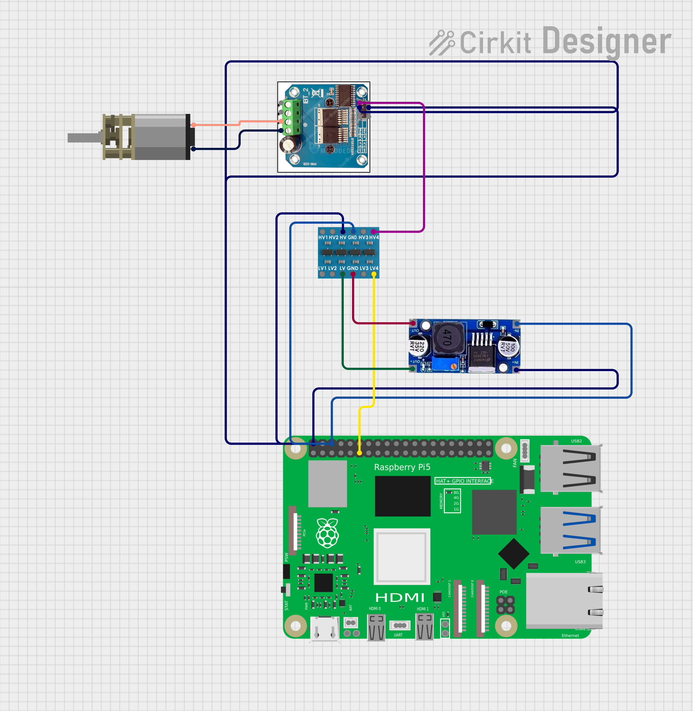

# LunaRoverA25-V2
LunaRoverA25 had some issues with a. torque, b. steering. LunaRoverA25-V2 aims to overcome these problems

## Introduction
I have a dog named Luna. I sometimes feel bad when I leave Luna to entertain herself. I wanted a cool new project to work on. Considering all that, I present to you.... the LunaRover.

## What already exists?
If I wanted to leave my dog in the garden to entertain herself, what products could I procure to achieve that? And how do those products compare to the real deal of me being with Luna? For example, I can give her a stick - which she will play with, but its nothing like the fun she has when I chase her around my garden. To get an understanding of that I thought it'd be useful to present a venn diagram with buckets for: how I currently entertain my dog, what autonomous systems exist, and what powered vehicles exist. The listed items within each bucket are by no means exhaustive, but inspire idea generation nonetheless.


It surprises me that I couldn't find evidence of someone having created an autonomous vehicle to play with their dog... that's something that I've sought to resolve.

## Proposed solution
Brushed motor radio controlled (rc) car modified to drive autonomously with the help of a raspberry pi.

## Method
### Design new RC car, with a customisable drivetrain
#### Step 1 - Design the RC car
The premise for designing my own RC car from scratch was to address the two failure points alluded to above:
a. Not enough torque
b. Steering mechanism getting caught in long grass

Point "a" can be addressed by having a drivetrain where gear ratio can easily be adjusted, therefore enabling for RPM to be compensated for torque, or vice versa. Point "b" can be addressed by having a dual wheel drive (one motor attached to a wheel on each side), therefore cicumventing the need for a steering system.


#### Step 2 - Design the electronics

The circuit design allows for PWM signals to be sent from the raspberry pi to the brushed dc motors, via the motor drivers. To do that it is necessary that 3.3V logic signals from the raspberry pi are converted to 5V logic signals which can be interpreted by the BTS7960 motor driver.



Note that the above intentionally excludes half the circuit (for the other dc motor and level shifter) and the power supply.

#### Step 3 - Design the firmware


```
